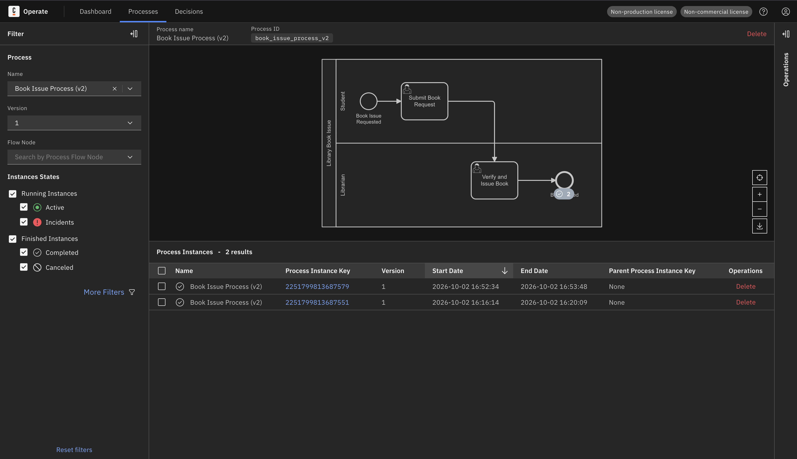

# Camunda Book Issue Process

A simple library book issue workflow implemented using Camunda 8.

## Process Flow

Book issue requested ↓ Submit book request ↓ Verify and issue book ↓ Book issued

The process has two lanes:

- **Student**: submits the book request
- **Librarian**: verifies the details and issues the book

## Form Fields

The same form (`book_issue_form`) is linked to both user tasks.

- Student Name (`studentName`)
- Book Title (`bookTitle`)
- Issue Date (`issueDate`)
- Due Date (`dueDate`)

## Project Files

| File | Description |
| --- | --- |
| `book_issue_process_v2.bpmn` | BPMN process with two lanes and two user tasks |
| `book_issue_form.form` | Camunda Form with keyed fields (Form ID: `book_issue_form`) |
| `screenshots/` | Screenshots of the model, form, and completed instances |

## Execution

The process and the form were deployed together and executed successfully using Camunda 8 Run.

The book details were submitted through Tasklist (**Submit Book Request**), then reviewed and completed by the librarian (**Verify and Issue Book**). The process completed successfully, and the completed instances were verified in Operate.

## Screenshots

### BPMN Process

### Tasklist Form

### Completed Process

